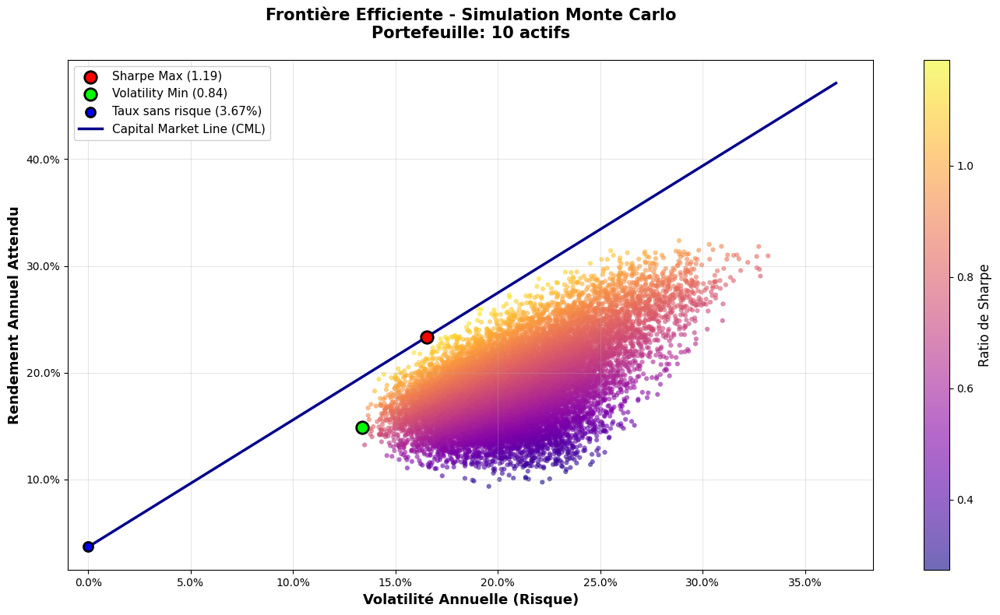

# 📈 Quantitative Portfolio Optimization & Walk-Forward Backtesting

### 🎯 Frontière Efficiente


Ce projet est un moteur d'optimisation de portefeuille et de backtest quantitatif développé en Python. S'appuyant sur la Théorie Moderne du Portefeuille (Markowitz), ce projet se démarque par une analyse détaillée des métriques de performance et des risques extrêmes (Tail Risk).

L'objectif n'est pas seulement de générer du rendement *In-Sample*, mais de concevoir des allocations robustes capables de survivre aux krachs boursiers grâce à une méthodologie stricte *Out-of-Sample* (Walk-Forward) et une stabilisation mathématique (Ledoit-Wolf).

## 🚀 Fonctionnalités Clés

* Univers d'Investissement Hybride : Analyse d'un portefeuille diversifié de 10 méga-capitalisations croisant la forte croissance (Tech : MSFT, GOOGL, NVDA...) et la résilience (Défensif/Industrie : WMT, PG, JNJ...).
* Optimisation Mathématique Avancée : Simulation de Monte Carlo (génération de dizaines de milliers de portefeuilles).
    * Optimisation Convexe (SLSQP) pour cibler le *Max Sharpe Ratio* et la *Min Volatility*.
    * Implémentation de la Matrice de Covariance de Ledoit-Wolf (Shrinkage) pour stabiliser les estimateurs face au bruit statistique du marché.
* Backtesting Réaliste (Walk-Forward) : Entraînement et test glissants pour simuler la performance réelle de l'algorithme dans le temps, avec prise en compte des **coûts de transaction** et du *Turnover*.
* Analyse Approfondie des Risques : 
    * Métriques Absolues : Volatilité, Max Drawdown, Recovery Time, Ratios de Sharpe, Sortino et Calmar.
    * Risques Extrêmes : Calcul de la VaR 95%, CVaR 95% (Expected Shortfall), Skewness (asymétrie) et Kurtosis (queues épaisses).
    * Métriques Relatives (vs SPY & QQQ) :* Alpha de Jensen, Beta, Tracking Error, Information Ratio.

## 📁 Architecture du Projet

Le code est modulaire :

```text
📂 portfolio-optimization/
├── 📄 main.py                   # Script principal d'exécution du pipeline
├── 📄 config.py                 # Fichier de paramétrage (Actifs, dates, contraintes)
├── 📄 requirements.txt          # Dépendances du projet
├── 📂 src/                      # Cœur de la logique métier
│   ├── data_loader.py           # Connexion API (yfinance)
│   ├── data_processing.py       # Log-returns, tests ADF de stationnarité, Ledoit-Wolf
│   ├── metrics.py               # Moteur de calcul des métriques financières
│   ├── models.py                # Solveurs d'optimisation (Monte Carlo, SLSQP)
│   ├── storage.py               # Gestion de la mémoire et des dictionnaires
│   ├── walk_forward_backtest.py # Algorithme de fenêtre glissante
│   └── visualization.py         # Fonctions graphiques (Matplotlib/Seaborn)
└── 📓 analyse_portfolio.ipynb   # Notebook Jupyter détaillant l'analyse financière complète
